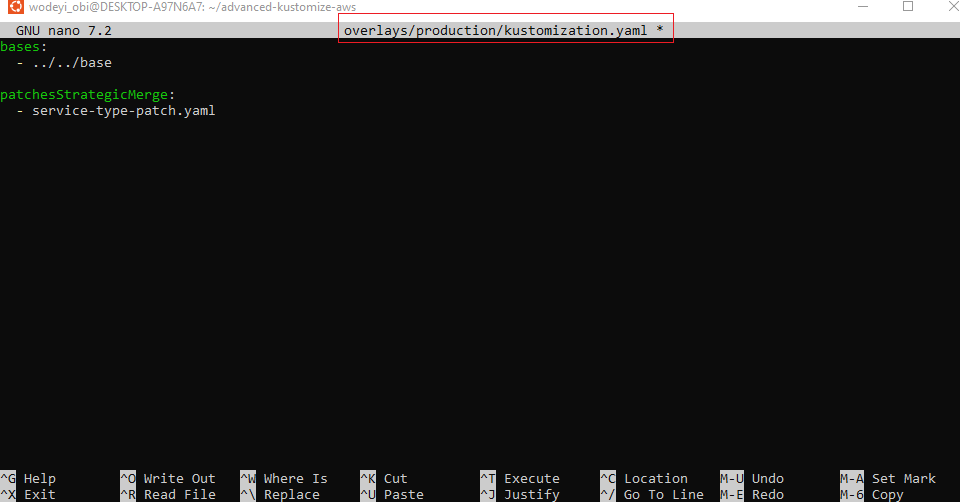
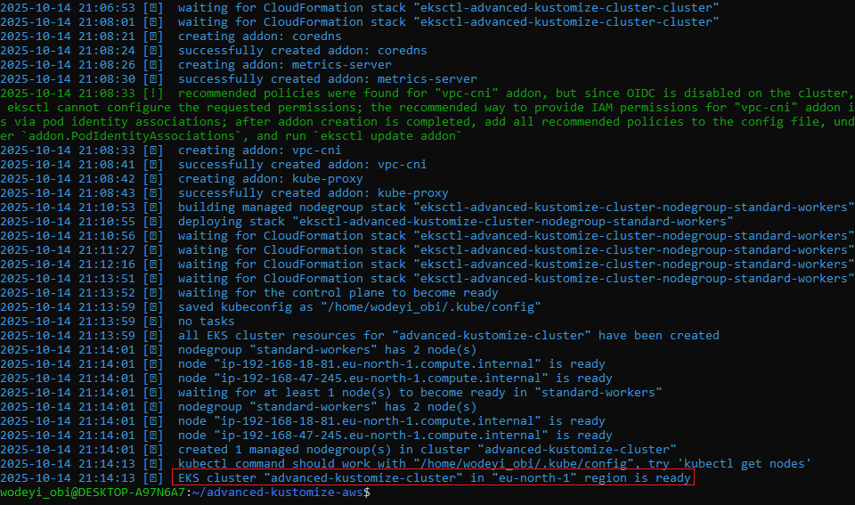
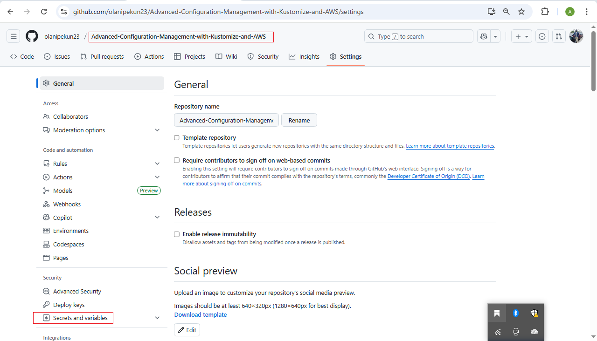

# 🧩 Advanced Configuration Management with Kustomize and AWS

## 📘 Project Overview
This project aims to **deepen your understanding of using Kustomize in Kubernetes**, focusing on:
- Integration with **CI/CD pipelines**,
- Managing **complex configurations**, and
- Applying **industry best practices** for configuration management.

You will gain hands-on experience building an automated and scalable Kubernetes deployment workflow leveraging **Kustomize**, **GitHub Actions**, and **Amazon EKS** (Elastic Kubernetes Service).

---

## 🎯 Why This Project Is Relevant
Think of this advanced Kustomize project as learning to **conduct a symphony orchestra**:

- In the early stages, you learn to play individual instruments — Kubernetes objects and simple Kustomize configurations.
- As you progress, you learn to conduct the orchestra — managing **complex configurations** and **automating deployments** with CI/CD pipelines.

Just like a conductor ensures every instrument plays in harmony, this project helps you orchestrate Kubernetes components to work seamlessly together, ensuring each configuration change (a note) plays at the right time in your **automated deployment symphony**.

---

## 🧠 Prerequisites
Before starting, ensure you have the following tools and knowledge:

| # | Prerequisite | Description | Installation/Documentation |
|---|---------------|-------------|-----------------------------|
| 1 | **Basic Kubernetes & Kustomize Knowledge** | Understanding of Kubernetes resources and Kustomize basics. | [Kubernetes Basics](https://kubernetes.io/docs/tutorials/kubernetes-basics/) • [Kustomize Introduction](https://kustomize.io/) |
| 2 | **Kustomize** | Tool for customizing Kubernetes configurations. | [Install Kustomize](https://kubectl.docs.kubernetes.io/installation/kustomize/) • [Kustomize GitHub Repo](https://github.com/kubernetes-sigs/kustomize) |
| 3 | **Docker** | For running containerized applications. | [Install Docker](https://docs.docker.com/get-docker/) • [Docker Docs](https://docs.docker.com/) |
| 4 | **kubectl** | Kubernetes CLI to interact with clusters. | [Install kubectl](https://kubernetes.io/docs/tasks/tools/) |
| 5 | **AWS CLI** | To interact with Amazon Web Services. | [Install AWS CLI](https://docs.aws.amazon.com/cli/latest/userguide/install-cliv2.html) |
| 6 | **Amazon EKS Setup** | Managed Kubernetes service on AWS. | [Amazon EKS User Guide](https://docs.aws.amazon.com/eks/latest/userguide/what-is-eks.html) |
| 7 | **CI/CD Platform** | Choose: GitHub Actions, Jenkins, or AWS CodePipeline. | [GitHub Actions Docs](https://docs.github.com/en/actions) |
| 8 | **Code Editor** | For editing configuration files (VS Code recommended). | [Visual Studio Code](https://code.visualstudio.com/) |
| 9 | **Internet Connection** | Required for online resources and cluster connectivity. | - |
| 10 | **GitHub Account (Optional)** | For version control and CI/CD integration. | [Sign up for GitHub](https://github.com/) |
| 11 | **Adequate Hardware** | Ensure your computer can handle Docker and Kubernetes workloads. | - |

---

## 📁 Example Project Structure

```bash
advanced-kustomize-aws/
├── base/
│   ├── deployment.yaml
│   ├── service.yaml
│   └── kustomization.yaml
├── overlays/
│   ├── development/
│   │   └── kustomization.yaml
│   └── production/
│       └── kustomization.yaml
├── .github/
│   └── workflows/
│       └── main.yml
└── README.md
```

---

## 🧩 Lesson 4.1 — Integrating Kustomize into a CI/CD Pipeline

### 🎯 Objective
Gain hands-on experience automating Kubernetes configuration management using **Kustomize** integrated with **GitHub Actions** CI/CD workflow.

---

### 🛠️ Step 1: Set Up GitHub Actions

#### a. Create a Repository
Ensure you have a GitHub repository for your Kubernetes project containing Kustomize configurations.

#### Example structure:
```
.github/workflows/
base/
overlays/
```

#### b. Create a Workflow File
In your repository, create:
```
.github/workflows/main.yml
```

---

### 🧱 Step 2: Configure the CI/CD Pipeline

#### a. Workflow Definition
Define the name and trigger event:

```yaml
name: Deploy with Kustomize
on:
  push:
    branches:
      - main
```

#### b. Define Jobs
Create a job named `deploy` running on Ubuntu:

```yaml
jobs:
  deploy:
    runs-on: ubuntu-latest
    steps:
```

#### c. Checkout Code

```yaml
- name: Checkout
  uses: actions/checkout@v2
```

#### d. Set Up Kubectl and Kustomize

```yaml
- name: Set up Kubectl
  uses: azure/setup-kubectl@v1

- name: Set up Kustomize
  uses: imranismail/setup-kustomize@v1
```

#### e. Apply Kustomize Configuration

```yaml
- name: Deploy to Kubernetes
  run: |
    kubectl apply -k ./overlays/production/
```

---

### ✅ Full Example Workflow

```yaml
# .github/workflows/main.yml
name: Deploy with Kustomize

on:
  push:
    branches:
      - main

jobs:
  deploy:
    runs-on: ubuntu-latest
    steps:
      - name: Checkout
        uses: actions/checkout@v2
      - name: Set up Kubectl
        uses: azure/setup-kubectl@v1
      - name: Set up Kustomize
        uses: imranismail/setup-kustomize@v1
      - name: Deploy to Kubernetes
        run: |
          kubectl apply -k ./overlays/production/
```

> 💡 **Note:** Ensure your GitHub Actions runner has access to your Kubernetes cluster (for example, using AWS credentials or kubeconfig secrets).

---

### 🧪 Step 3: Testing the CI/CD Pipeline

1. **Make configuration changes**  
   Modify a Kustomize overlay (e.g., update replica count or environment variable).

2. **Commit and push changes**
   ```bash
   git add .
   git commit -m "Update Kustomize configuration"
   git push origin main
   ```

3. **Observe pipeline execution**
   - Open the **Actions** tab in your GitHub repository.
   - Watch the workflow run logs.
   - Confirm changes are applied to your Kubernetes cluster.

---

### 🚀 Step 4: Advanced (Optional)

#### a. Add Environment Variables or Secrets
Use GitHub Secrets for storing sensitive data:
- `AWS_ACCESS_KEY_ID`
- `AWS_SECRET_ACCESS_KEY`
- `KUBE_CONFIG`

#### b. Enhanced Workflow Triggers
Trigger workflows on:
- Pull requests
- Specific directory changes
- Tags or release events

---

## ⚙️ Lesson 4.2 — Handling Complex Configurations

### 🎯 Objective
Explore strategies for managing large-scale and complex Kubernetes configurations.

---

### 🧩 Tasks and Steps

#### a. Organize Configuration Structure
Use a hierarchical directory structure for multi-app or multi-environment management:
```
apps/
├── frontend/
│   └── overlays/
├── backend/
│   └── overlays/
```

#### b. Use Kustomize Features
- **Overlays** — customize base configs for different environments  
- **Patches** — modify specific fields dynamically  
- **Generators** — generate ConfigMaps and Secrets on the fly

Example:
```yaml
# overlays/production/kustomization.yaml
bases:
  - ../../base
patches:
  - replica-patch.yaml
configMapGenerator:
  - name: app-config
    literals:
      - LOG_LEVEL=INFO
```

---

## 💡 Lesson 4.3 — Best Practices and Tips

| Category | Recommendation |
|-----------|----------------|
| 🧱 Structure | Separate base and overlay directories clearly. |
| 🔒 Security | Never hard-code secrets; use sealed secrets or GitHub Secrets. |
| ⚡ Efficiency | Use `kustomize build` locally to validate manifests before deployment. |
| 🔁 CI/CD | Automate validation and deployment steps through GitHub Actions. |
| ☁️ Scalability | Use different overlays for staging, QA, and production. |
| 🧩 Maintainability | Keep your base configuration DRY (Don’t Repeat Yourself). |

---











## 🧾 Expected Outcome

By the end of this project, you will:
- Understand **advanced Kustomize concepts**
- Implement **automated CI/CD pipelines** for Kubernetes deployments
- Manage **complex multi-environment configurations**
- Deploy workloads seamlessly to **Amazon EKS**

---

## 🧰 Additional Resources

- [Kustomize Official Docs](https://kubectl.docs.kubernetes.io/references/kustomize/)
- [GitHub Actions for Kubernetes](https://github.com/marketplace?type=actions&query=kubernetes)
- [AWS EKS Documentation](https://docs.aws.amazon.com/eks/)
- [Kubernetes Best Practices](https://kubernetes.io/docs/setup/best-practices/)

---

## 🏁 Author & License
**Author:** Emmanuel Tobi Awodeyi  
**License:** MIT License
